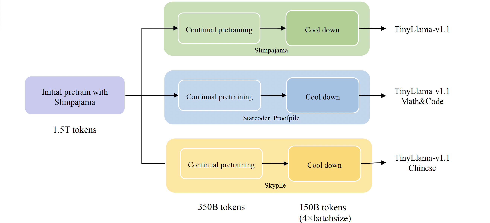

# TinyLlama-1.1B-v1.1

- **Codebase:** [github.com/jzhang38/TinyLlama](https://github.com/jzhang38/TinyLlama)
- **Technical Report:** [arxiv.org/pdf/2401.02385](https://arxiv.org/pdf/2401.02385) 

<div align="center">
  
</div>

We adopted exactly the same architecture and tokenizer as Llama 2. This means TinyLlama can be plugged and played in many open-source projects built upon Llama. Besides, TinyLlama is compact with only 1.1B parameters. This compactness allows it to cater to a multitude of applications demanding a restricted computation and memory footprint.

## Overview

In this project, rather than only training a single TinyLlama model, we first train TinyLlama on a corpus of 1.5 trillion tokens to obtain foundational language capabilities. Subsequently, we take this model and turn it into three different models by continual pre-training with three distinct data sampling. For a visual representation of this process, please refer to the figure below.



## Pretraining

Due to these issues([bug1](https://whimsical-aphid-86d.notion.site/Release-of-TinyLlama-1-5T-Checkpoints-Postponed-01b266998c1c47f78f5ae1520196d194?pvs=4), [bug2](https://whimsical-aphid-86d.notion.site/2023-12-18-Updates-from-TinyLlama-Team-7d30c01fff794da28ccc952f327c8d4f)). We try to retrain our TinyLlama to provide a better model. We train our model with 2T tokens and divided our pretraining into 3 different stages: 1) basic pretraining, 2) continual pretraining with specific domain, and 3) cooldown .

#### Basic pretraining

In this initial phase, we managed to train our model with only slimpajama to develop its commonsense reasoning capabilities. The model was trained with 1.5T tokens during this basic pretraining period. Since we used a cluster with 4 A100-40G per node and we only shard model weights within a node, we can only set the batch size to approximately 1.8M this time.

#### Continual pretraining with specific domain

We incorporated 3 different kinds of corpus during this pretraining, slimpajama (which is the same as the first phase), Math&Code (starcoder and proof pile), and Chinese (Skypile). This approach allowed us to develop three variant models with specialized capabilities.

At the begining ~6B tokens in this stage, we linearly increased the sampling proportion for the domain-specific corpus (excluding Slimpajama, as it remained unchanged compared with stage 1). This warmup sampling increasing strategy was designed to gradually adjust the distribution of the pretraining data, ensuring a more stable training process. After this sampling increasing stage, we continued pretraining the model with stable sampling strategy until reaching ~1.85T tokens.

#### Cooldown

Implementing a cooldown phase has become a crucial technique to achieve better model convergence at the end of pretraining. However, since we have already used cosine learning rate strategy at the beginning, it becomes challenging to alter the learning rate for cooldown like what MiniCPM or deepseek does. Therefore, we try to cool down with adjusting our batch size. Specifically, we increase our batch size from 1.8M to 7.2M while keeping the original cosine learning rate schedule during our cooldown stage.

#### Tinyllama model family

Following an extensive and detailed pretraining process. We are now releasing three specialized versions of our model:

1. **TinyLlama_v1.1**: The standard version, used for general purposes.
2. **TinyLlama_v1.1_Math&Code**: Equipped with better ability for math and code.
3. **TinyLlama_v1.1_Chinese**: Good understanding capacity for Chinese.

## Data

Here we list our data distribution in each stage:

### TinyLlama_v1.1

| Corpus        | Basic pretraining | Continual pretraining with specific domain | Cooldown |
| ------------- | ----------------- | ------------------------------------------ | -------- |
| Slimpajama | 100.0              | 100.0                                       | 100.0      |

### TinyLlama_v1.1_math_code

| Corpus        | Basic pretraining | Continual pretraining with specific domain | Cooldown |
| ------------- | ----------------- | ------------------------------------------ | -------- |
| Slimpajama | 100.0              | 75.0                                         | 75.0        |
| starcoder     | -                 | 15.0                                       | 15.0     |
| proof_pile    | -                 | 10.0                                       | 10.0     |

### TinyLlama_v1.1_chinese

| orpus         | Basic pretraining | Continual pretraining with specific domain | Cooldown |
| ------------- | ----------------- | ------------------------------------------ | -------- |
| Slimpajama | 100.0               | 50.0                                            | 50.0          |
| skypile       | -                 | 50.0                                       | 50.0     |

### How to use
You will need the transformers>=4.31
Do check the [TinyLlama](https://github.com/jzhang38/TinyLlama) GitHub page for more information.
```
from transformers import AutoTokenizer
import transformers 
import torch
model = "TinyLlama/TinyLlama_v1.1"
tokenizer = AutoTokenizer.from_pretrained(model)
pipeline = transformers.pipeline(
    "text-generation",
    model=model,
    torch_dtype=torch.float16,
    device_map="auto",
)

sequences = pipeline(
    'The TinyLlama project aims to pretrain a 1.1B Llama model on 3 trillion tokens. With some proper optimization, we can achieve this within a span of "just" 90 days using 16 A100-40G GPUs 🚀🚀. The training has started on 2023-09-01.',
    do_sample=True,
    top_k=10,
    num_return_sequences=1,
    repetition_penalty=1.5,
    eos_token_id=tokenizer.eos_token_id,
    max_length=500,
)
for seq in sequences:
    print(f"Result: {seq['generated_text']}")
```

### Eval
| Model                                     | Pretrain Tokens | HellaSwag | Obqa      | WinoGrande | ARC_c     | ARC_e     | boolq | piqa      | avg       |
| ----------------------------------------- | --------------- | --------- | --------- | ---------- | --------- | --------- | ----- | --------- | --------- |
| Pythia-1.0B                               | 300B            | 47.16     | 31.40     | 53.43      | 27.05     | 48.99     | 60.83 | 69.21     | 48.30     |
| TinyLlama-1.1B-intermediate-step-1431k-3T | 3T              | 59.20     | 36.00     | 59.12      | 30.12     | 55.25     | 57.83 | 73.29     | 52.99     |
| TinyLlama-1.1B-v1.1                       | 2T              | **61.47** | **36.80** | 59.43  | 32.68 | **55.47** | 55.99 | **73.56** | 53.63 |
| TinyLlama-1.1B-v1_math_code                        | 2T              | 60.80 | 36.40 | **60.22**  | **33.87** | 55.20 | 57.09 | 72.69 | **53.75** |
| TinyLlama-1.1B-v1.1_chinese                       | 2T              | 58.23 | 35.20 | 59.27  | 31.40 | 55.35 | **61.41** | 73.01 | 53.41 |